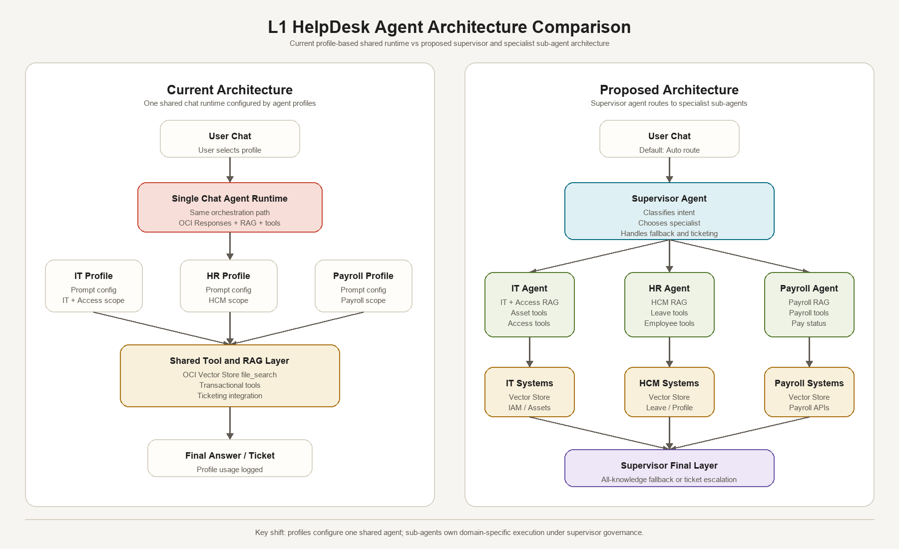

# L1 HelpDesk Agent MVP

An OCI-native Level-1 helpdesk agent MVP for employee self-service, knowledge retrieval, and ticket escalation.

## Scope

### User

- AI chat with multi-turn conversation history
- Suggested prompts
- Knowledge-grounded answers
- Citations and expandable source details
- Zendesk ticket escalation
- My Tickets table and details drawer

### Admin

- Dashboard metrics: documents, chunks, questions asked, tickets created, escalation rate
- Knowledge Base Management: upload PDF/DOCX/TXT, view documents and status
- Agents: General Helpdesk Assistant, IT Support, HR Assistant, Payroll Assistant, Onboarding Assistant
- Conversation Monitoring
- Execution Trace

## Tech Stack

### Frontend - Oracle Nitro Redwood

- React
- TypeScript
- Vite
- Oracle Nitro Redwood UI packages: `@idp/nitro-redwood`
- Nitro application providers: `@idp/nitro-providers`
- Nitro Redwood CSS and theme styling
- Tailwind CSS
- Lucide Icons
- TanStack Query

### Backend

- FastAPI
- Pydantic
- SQLAlchemy
- SQLite for MVP metadata
- Zendesk API for ticket creation

### OCI Services

- OCI OpenAI-compatible Responses API for chat responses and conversation state
- OCI Vector Store file search for knowledge-grounded answers

The backend is OCI-only. `USE_LOCAL_AI=true` is rejected at startup so model responses must come through the configured OCI services. SQLite remains the MVP metadata store for agents, conversations, tickets, citations, vector-store file IDs, and local chunk previews.

The backend calls OCI's OpenAI-compatible Responses API with a `file_search` tool attached to `OCI_VECTOR_STORE_ID`. The React UI uses the `/api/chat` JSON contract, and the backend maps its local `conversation_id` to OCI `previous_response_id`.

The frontend uses Oracle Nitro packages for the Redwood-styled UI foundation, including Nitro providers, Nitro Redwood CSS, and Nitro Redwood components such as navigation, tables, buttons, badges, inputs, drawers, and empty states. A short Nitro setup and usage manual is available in [docs/Nitro_UI_Setup_and_Usage_Manual.docx](docs/Nitro_UI_Setup_and_Usage_Manual.docx).

## Agent Architecture

The user chat enters through the General Helpdesk Assistant, which acts as the supervisor agent. The supervisor uses OCI model routing to choose the best specialist agent for the query. Each specialist has its own instructions, allowed knowledge categories, and transactional tool scope. If the selected specialist cannot answer with enough confidence, the supervisor can try a secondary specialist or fall back to the general all-knowledge path before ticket escalation.



Backend agent workflow files:

- `backend/app/services/agent_orchestrator.py`: supervisor routing, specialist execution, fallback, persistence, trace creation
- `backend/app/services/oci.py`: OCI Responses API, file search, routing call, function-tool submission
- `backend/app/services/transaction_tools.py`: demo enterprise transaction tools and per-agent tool scopes
- `backend/app/routers/chat.py`: thin chat API wrapper around the agent workflow

## Run Locally

### Backend

```powershell
cd mvp-l1-helpdesk-agent\backend
python -m venv .venv
.\.venv\Scripts\Activate.ps1
pip install -r requirements.txt
copy .env.example .env
notepad .env
uvicorn app.main:app --reload --port 8088
```

Required backend environment values:

```dotenv
APP_NAME=L1 HelpDesk Agent MVP
DATABASE_URL=sqlite:///./helpdesk_mvp.db
USE_LOCAL_AI=false
LOCAL_STORAGE_DIR=./tmp

OCI_CONFIG_FILE=~/.oci/config
OCI_PROFILE=DEFAULT
OCI_CONFIG_PROFILE=DEFAULT
OCI_REGION=<your-oci-region>
OCI_GENAI_REGION=<your-oci-region>
OCI_GENAI_PROJECT_OCID=<your-genai-project-ocid>
OCI_COMPARTMENT_ID=<your-compartment-ocid>
OCI_GENAI_MODEL=openai.gpt-oss-120b
OCI_RESPONSES_MODEL_ID=openai.gpt-oss-120b
OCI_FILE_SEARCH_MODEL=google.gemini-2.5-flash
OCI_VECTOR_STORE_ID=<your-oci-vector-store-id>
OCI_VECTOR_STORE_CHUNK_SIZE=1000
OCI_VECTOR_STORE_CHUNK_OVERLAP=200
OCI_VECTOR_STORE_MAX_WAIT_SECONDS=900

ZENDESK_SUBDOMAIN=<your-zendesk-subdomain>
ZENDESK_EMAIL=<zendesk-admin-or-agent-email>
ZENDESK_API_TOKEN=<zendesk-api-token>
ZENDESK_DEFAULT_REQUESTER_NAME=L1 HelpDesk User
ZENDESK_DEFAULT_REQUESTER_EMAIL=<requester-email-for-mvp>
ZENDESK_GROUP_ID=
ZENDESK_TAGS=l1-helpdesk-agent,oci-ai
```

The OCI profile must be able to call the OpenAI-compatible OCI Generative AI Responses endpoint, upload files to OCI Vector Store, and attach/delete files in the configured vector store.
The Zendesk user must be allowed to create tickets through the Zendesk API.

### Frontend

```powershell
cd mvp-l1-helpdesk-agent\frontend
npm install
$env:VITE_API_BASE="http://localhost:8088/api"
npm run dev
```

Open:

```text
http://localhost:5178
```

Backend health:

```text
http://localhost:8088/api/health
```

## Notes

- SQLite is used for MVP metadata.
- File uploads are attached directly to the configured OCI Vector Store. A temporary local copy is used only for Vector Store upload and PDF/DOCX/TXT preview extraction, then removed.
- Chat responses and file-search retrieval require OCI configuration.
- Ticket creation requires Zendesk configuration. The backend creates the Zendesk ticket first, then stores the Zendesk ticket ID and URL locally for monitoring.
